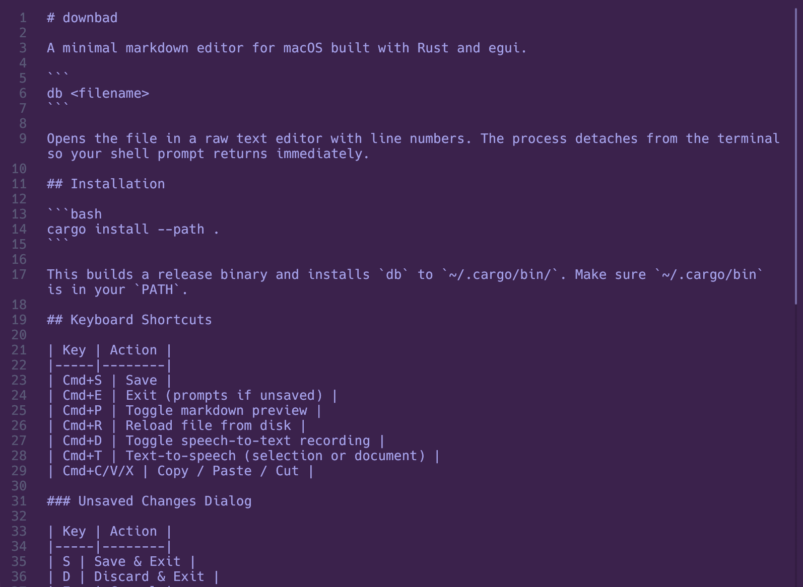
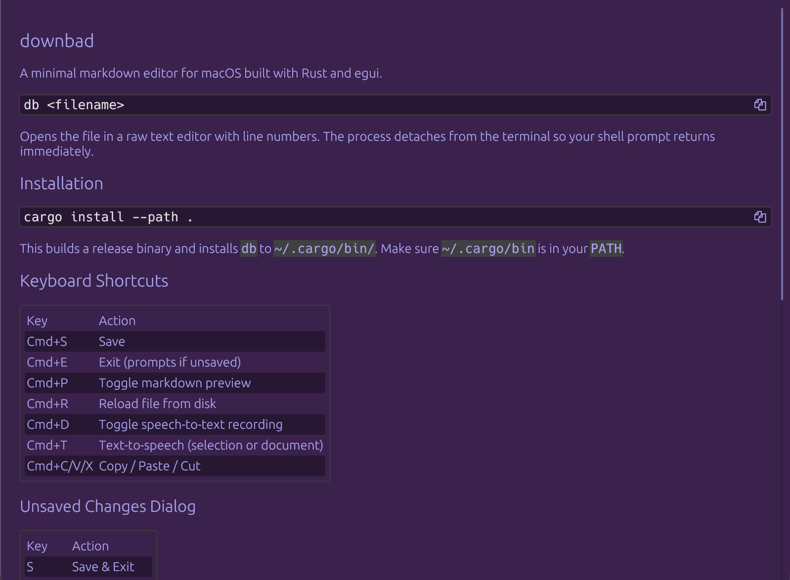

# db - downbad

A minimal markdown editor for macOS built with Rust and egui.

```
db <filename>
```

Opens the file in a raw text editor with line numbers. The process detaches from the terminal so your shell prompt returns immediately.

| Editing | Preview (Cmd+P) |
|---------|-----------------|
|  |  |

## Installation

```bash
cargo install --path .
```

This builds a release binary and installs `db` to `~/.cargo/bin/`. Make sure `~/.cargo/bin` is in your `PATH`.

## Keyboard Shortcuts

| Key | Action |
|-----|--------|
| Cmd+S | Save |
| Cmd+E | Exit (prompts if unsaved) |
| Cmd+P | Toggle markdown preview |
| Cmd+R | Reload file from disk |
| Cmd+D | Toggle speech-to-text recording |
| Cmd+T | Text-to-speech (selection or document) |
| Cmd+C/V/X | Copy / Paste / Cut |

### Unsaved Changes Dialog

| Key | Action |
|-----|--------|
| S | Save & Exit |
| D | Discard & Exit |
| Esc | Cancel |

## Speech-to-Text

Cmd+D starts recording from the default microphone. Press Cmd+D again to stop and transcribe. The Whisper model is loaded lazily on first use, so it never slows down app startup.

### Setup (one-time)

```bash
mkdir -p ~/.local/share/downbad
curl -L -o ~/.local/share/downbad/ggml-base.en.bin \
  https://huggingface.co/ggerganov/whisper.cpp/resolve/main/ggml-base.en.bin
```

## Text-to-Speech

Cmd+T speaks the selected text (or full document if nothing is selected) aloud using the Kokoro-82M TTS model running locally via ONNX Runtime. Press Cmd+T again to stop playback.

### Setup (one-time)

Download the three model files into `~/.local/share/downbad/`:

```bash
mkdir -p ~/.local/share/downbad
# ONNX model (quantized, ~92 MB)
curl -L -o ~/.local/share/downbad/kokoro-v1.0.onnx \
  https://huggingface.co/onnx-community/Kokoro-82M-v1.0-ONNX/resolve/main/onnx/model_quantized.onnx
# Tokenizer
curl -L -o ~/.local/share/downbad/kokoro-tokenizer.json \
  https://huggingface.co/onnx-community/Kokoro-82M-v1.0-ONNX/resolve/main/tokenizer.json
# Voice style (af_heart)
curl -L -o ~/.local/share/downbad/kokoro-voice.bin \
  https://huggingface.co/onnx-community/Kokoro-82M-v1.0-ONNX/resolve/main/voices/af_heart.bin
```
